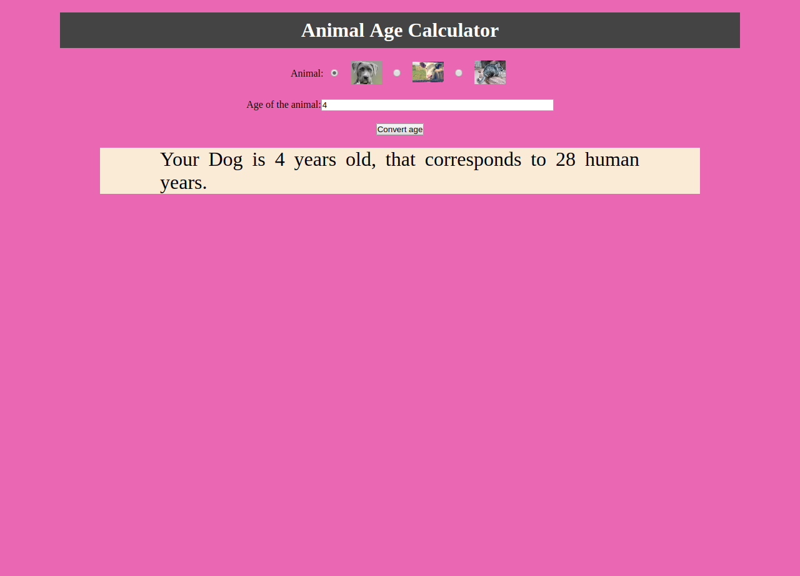

# JS-animal-age

This webpage was created by Stefan Klinkusch at Digital Career Institute in Berlin, Germany using HTML, CSS, and vanilla JavaScript. It takes the age of an animal (dogs, cows, and chinchillas are supported) and converts the animal age to the correspondent age in human years.

## Features

The page features
- a header with the title of the page
- a set of three radio buttons to choose the animal
  - dog (conversion rate: 7 human years per year)
  - cow (conversion rate: 14 human years per year)
  - chinchilla (conversion rate: 25 human years per year)
- an input field to write the animal age in years
- a submit button to trigger the conversion and the output
- an output field with the input data and the correspondent age in human years

## Screenshot

